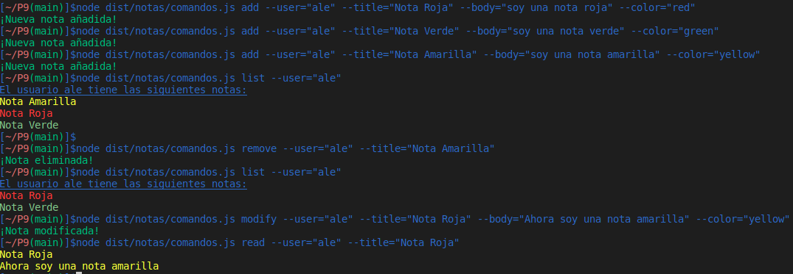

## Introducción
En esta práctica realizaremos 1 ejercicio en TypeScript utilizando node y algunas librerías, además intentaremos respetar los `principios SOLID`, crearemos el directorio adecuado para desarrollar proyectos en TS y utilizaremos herramientas como `EsLint` para el estilo del código según `Google` en nuestro caso, `TypeDoc` para la generación de la documentación del código de nuestro proyecto, `Mocha` y `Chai` para la creación de pruebas que nos permitiran llevar acabo el desarrollo `TDD` y multiples `github actions` como la de `Coveralls` y `Sonar`.

## Primeros pasos
Lo primero que tendremos que hacer es aprender a utlizar los paquetes que se utilizarán a lo largo de la práctica, para ser exactos los paquetes de [yargs](https://www.npmjs.com/package/yargs) y [chalk](https://www.npmjs.com/package/chalk). Por otro lado también tendremos que familiarizarnos con con la [API síncrona](https://nodejs.org/dist/latest-v18.x/docs/api/fs.html#synchronous-api) proporcionada por Node.js que trabaja con los sistemas de ficheros.

## Ejercicio.
En este ejercicio tendremos que crear diferentes clases para realizar diferentes funciones ya que queremos respetar los principios SOLID, para empezar hablemos de la clase nota.ts que es el corazón de este programa ya que es el encargado de almacenar la información de las diferentes notas, el código desarrollado es el siguiente:

```typescript

/**
 * @type colorType: string
 */
export type colorType = 'red' | 'green' | 'blue' | 'yellow';

/**
 * @class Nota
 */
export class Nota {
  /**
   * Constructor
   * @param titulo titulo de la nota
   * @param cuerpo cuerpo de la nota
   * @param color color de la nota
   */
  constructor(private titulo: string, private cuerpo: string, private color: colorType) {}

  /**
   * Getter
   * @returns el titulo de la nota
   */
  getTitulo(): string {
    return this.titulo;
  }

  /**
   * Getter
   * @returns el cuerpo de la nota
   */
  getCuerpo(): string {
    return this.cuerpo;
  }

  /**
   * Getter
   * @returns el color de la nota
   */
  getColor(): colorType {
    return this.color;
  }

  /**
   * Setter
   * @param titulo nuevo titulo de la nota
   */
  setTitulo(titulo: string): void {
    this.titulo = titulo;
  }

  /**
   * Setter
   * @param cuerpo nuevo cuerpo de la nota
   */
  setCuerpo(cuerpo: string): void {
    this.cuerpo = cuerpo;
  }

  /**
   * Setter
   * @param color nuevo color de la nota
   */
  setColor(color: colorType): void {
    this.color = color;
  }
}
```

En esta clase no hay mucho que destacar ya que simplemente almacena la información de la nota, como mucho podemos hablar del tipo de dato `colorType` que basicamente es un tipo de dato que solo puede tomar los colores que plantea la práctica, estos colores están en inglés ya que es necesario que estén este idioma para poder usarlos en el paquete `chalk` aunque de esto ya hablaremos luego.

En esta práctica como vamos a trabajar con ficheros `.json` será neecsario tener un método que convierta los atributos de la clase Nota a un string en formato .json, este método se puede crear en la propia clase Nota sin ningún problema pero como queremos respetar los `principios SOLID` crearemos una clase a parte que reciba como parámetro un `objeto Nota`, el código es el siguiente:

```typescript
import {Nota} from "./nota";

/**
 * @class JSON Nota
 */
export class JSONNota {
  /**
   * Coonstructor
   * @param nota objeto de la clase Nota
   */
  constructor(private nota: Nota) {}
  
  /**
  * Metodo que convierte el objeto nota a un string JSON
  * @returns Una cadena de texto con el formato JSON
  */
  json(): string {
    return `{\"titulo\": \"${this.nota.getTitulo()}\", \"cuerpo\": \"${this.nota.getCuerpo()}\", \"color\": \"${this.nota.getColor()}\"}`;
  }
}
```

Una vez hablado de las clases más básicas vamos a hablar de la clase que permite que la app funcione, es decir, la clase que permite añadir, eliminar, borrar, listar y leer una nota, el código es el siguiente:

```typescript
import {Nota, colorType} from "./nota";
import {JSONNota} from "./jsonNota";
import * as fs from "fs";

const chalk = require("chalk");

/**
 * @class Gestion Nota
 */
export class GestionNota {
  /**
   * Método que crea una nota.
   * @param usuario nombre del usuario
   * @param titulo titulo de la nota
   * @param cuerpo cuerpo de la nota
   * @param color color de la nota
   * @returns true si se pudo añadir la nota, false si no.
   */
  añadirNota(usuario: string, titulo: string, cuerpo: string, color: colorType): boolean {
    if (!fs.existsSync(`database/${usuario}`)) {
      console.log(`Creando database para el usuario: ${usuario}`);
      
      fs.mkdirSync(`database/${usuario}`, {
        recursive: true,
      });
    }

    if (!fs.existsSync(`database/${usuario}/${titulo}.json`)) {
      const impNota = new JSONNota(new Nota(titulo, cuerpo, color));
      fs.writeFileSync(`database/${usuario}/${titulo}.json`, impNota.json());

      console.log(chalk.green("¡Nueva nota añadida!"));
      return true;
    } else {
      console.log(chalk.red("¡ERROR, ya existe una nota con ese título!"));
      return false;
    }
  }

  /**
   * Método que elimina la nota de un usuario.
   * @param usuario nombre del usuario
   * @param titulo titulo de la nota
   * @returns true si se eliminó la nota, false si no.
   */
  eliminarNota(usuario: string, titulo: string): boolean {
    if (fs.existsSync(`database/${usuario}/${titulo}.json`)) {
      fs.rmSync(`database/${usuario}/${titulo}.json`);
      console.log(chalk.green("¡Nota eliminada!"));

      return true;
    } else {
      console.log(chalk.red(`¡ERROR, no se ha encontrado la nota ${titulo} para el usuario ${usuario}!`));

      return false;
    }
  }

  /**
   * Método que modifica una nota.
   * @param usuario nombre del usuario
   * @param titulo titulo de la nota
   * @param cuerpo cuerpo de la nota
   * @param color color de la nota
   * @returns true si la nota fue modificada, false si no.
   */
  modificarNota(usuario: string, titulo: string, cuerpo: string, color: colorType): boolean {
    if (fs.existsSync(`database/${usuario}/${titulo}.json`)) {
      const impNota = new JSONNota(new Nota(titulo, cuerpo, color));

      fs.writeFileSync(`database/${usuario}/${titulo}.json`, impNota.json());
      console.log(chalk.green("¡Nota modificada!"));

      return true;
    } else {
      console.log(chalk.red(`¡ERROR, no se ha encontrado la nota ${titulo} para el usuario ${usuario}!`));
      return false;
    }
  }

  /**
   * Méto que lista las notas de un usuario.
   * @param usuario nombre del usuario
   * @returns true si el usuario tiene alguna nota, false si no.
   */
  listarNotas(usuario: string) {
    if (fs.existsSync(`database/${usuario}`) && fs.readdirSync(`database/${usuario}`).length > 0 ) {
      fs.readdirSync(`database/${usuario}`).forEach((notas) => {
        const informacionNota = fs.readFileSync(`database/${usuario}/${notas}`);
        const jsonNota = JSON.parse(informacionNota.toString());
        const nota = new Nota(jsonNota.titulo, jsonNota.cuerpo, jsonNota.color);

        console.log(chalk.keyword(nota.getColor())(nota.getTitulo()));
      });

      return true;
    } else {
      console.log(chalk.red("¡ERROR, hubo un problema con el nombre del usuario o el usuario no tiene notas!"));
      return false;
    }
  }

  /**
   * Método que muestra la nota del usuario.
   * @param usuario nombre del usuario
   * @param titulo titulo de la nota
   * @returns true si se pudo encontrar la nota, false si no.
   */
  leerNota(usuario: string, titulo: string) {
    if (fs.existsSync(`database/${usuario}/${titulo}.json`)) {
      const informacionNota = fs.readFileSync(`database/${usuario}/${titulo}.json`);
      const jsonNota = JSON.parse(informacionNota.toString());
      const nota = new Nota(jsonNota.titulo, jsonNota.cuerpo, jsonNota.color);
      
      console.log(chalk.keyword(nota.getColor())(nota.getTitulo()));
      console.log(chalk.keyword(nota.getColor())(nota.getCuerpo()));

      return true;
    } else {
      console.log(chalk.red("¡ERROR, no se ha encontrado la nota!"));
      return false;
    }
  }
}
```

Primero vamos a hablar del método `añadirNota`, como su propio nombre indica este método nos permitirá añadir una nota, para ello primero tendremos que ver si el usuario tiene un directorio donde almacenar sus notas y si no lo tiene se lo creamos, una vez hecho lo anterior solo nos quedaría mirar si la nota que quiere añadir ya existe para ese usuario, si es así no le permitimos que la añada pero si no es así la añadimos. Añadir una nota implica crear un fichero `.json` con el nombre de la nota en el directorio del usuario, para escribir los datos de la nota en formato .json utilizamos la clase que hemos creado para ello.

En segundo lugar vamos a comentar el método `eliminarNota`, este método es el encargado de eliminar una nota, para que una nota pueda ser eliminada primero debe existir para el ususario en cuestión y en el caso de que exista lo que haremos es eliminar el `archivo .json` que la contiene.

En tercer lugar tenemos al método `modificarNota`, que es el encargado de modificar una nota, como el método `eliminarNota` su funcionamiento es muy sencillo, primero miraremos si la nota existe para ese usuario y si es así volveremos a escribir en el fichero la nueva informarción, eliminando la que anteriormente estaba.

En cuarto lugar nos encontramos con el método `listarNotas`, que como su nombre indica se encarga de listar las notas, lo primero que haremos es ver si el usuario en cuestión tiene al menos una nota, si es así recorreremos todos los archivos del directorio del usuario y los leeremos, la información del `buffer` la pasremos a un objeto `JSON` y luego crearemos un objeto `Nota` con los atributos del objeto `JSON`, una vez hecho todo esto mostraremos los títulos de las notas. En este método y en el `leerNota` nos encontramos con:

```typescript
console.log(chalk.keyword(nota.getColor())(nota.getTitulo()));
```

Este console log muestra el título de la nota en el color de dicha nota, es por esto que necesitamos que los colores de las notas estén en inglés, ya que si las ponemos en otro idioma el paquete chalk arrojará multiples errores ya que ese color no estará disponible entre los del paquete.

Por último pero no menos importante tenemos el método `leerNota`, que se encarga de leer una nota, para ello miramos si el usuario en cuestión tiene una nota con el título especificado y si es así sacamos la información del archivo de la misma manera que expliqué en el método `listarNotas` y mostraremos la información por la pantalla con el color de la nota como antes explicamos.

Para terminar de explicar el código que he desarrollado en esta práctica vamos a comentar el código que se encarga de leer los datos desde la consola y ejecutar los difentes métodos, este es el código desarrollado:

```typescript
import {GestionNota} from './gestionNota';
import * as yargs from 'yargs';

const chalk = require("chalk");


const gestion = new GestionNota();

/**
 * Comando que permite añadir una nota
 */
yargs.command({
  command: 'add',
  describe: 'Añade una nueva nota',
  builder: {
    user: {
      describe: 'Nombre de usuario',
      demandOption: true,
      type: 'string',
    },
    title: {
      describe: 'Titulo de la nota',
      demandOption: true,
      type: 'string',
    },
    body: {
      describe: 'Cuerpo de la nota',
      demandOption: true,
      type: 'string',
    },
    color: {
      describe: 'Color de la nota',
      demandOption: true,
      type: 'string',
    },
  },
  handler(argv) {
    if (typeof argv.user === 'string' && typeof argv.title === 'string' &&
        typeof argv.body === 'string' && typeof argv.color === 'string' && 
        (argv.color === 'red' || argv.color === 'green' || argv.color === 'blue'||
        argv.color === 'yellow')) {
      gestion.añadirNota(argv.user, argv.title, argv.body, argv.color);
    } else {
      console.log(chalk.red('Argumentos invalidos, reviselos y vuelva a intentarlo'));
    }
  },
});

/**
 * Comando que permite modificar una nota.
 */
yargs.command({
  command: 'modify',
  describe: 'Modifica una nota',
  builder: {
    user: {
      describe: 'Nombre de usuario',
      demandOption: true,
      type: 'string',
    },
    title: {
      describe: 'Titulo de la nota',
      demandOption: true,
      type: 'string',
    },
    body: {
      describe: 'Cuerpo de la nota',
      demandOption: true,
      type: 'string',
    },
    color: {
      describe: 'Color de la nota',
      demandOption: true,
      type: 'string',
    },
  },
  handler(argv) {
    if (typeof argv.user === 'string' && typeof argv.title === 'string' &&
        typeof argv.body === 'string' && typeof argv.color === 'string' && 
        (argv.color === 'red' || argv.color === 'green' || argv.color === 'blue'||
        argv.color === 'yellow')) {
      gestion.modificarNota(argv.user, argv.title, argv.body, argv.color);
    } else {
      console.log(chalk.red('Argumentos invalidos, reviselos y vuelva a intentarlo'));
    }
  },
});

/**
 * Comando que permite leer una nota
 */
yargs.command({
  command: 'read',
  describe: 'Lee una nota',
  builder: {
    user: {
      describe: 'Nombre de usuario',
      demandOption: true,
      type: 'string',
    },
    title: {
      describe: 'Titulo de la nota',
      demandOption: true,
      type: 'string',
    },
  },
  handler(argv) {
    if (typeof argv.user === 'string' && typeof argv.title === 'string') {
      gestion.leerNota(argv.user, argv.title);
    } else {
      console.log(chalk.red('Argumentos invalidos, reviselos y vuelva a intentarlo'));
    }
  },
});

/**
 * Comando que permite listarlas notas
 */
yargs.command({
  command: 'list',
  describe: 'Lista todas las notas',
  builder: {
    user: {
      describe: 'Nombre de usuario',
      demandOption: true,
      type: 'string',
    },
  },
  handler(argv) {
    if (typeof argv.user === 'string') {
      console.log(chalk.underline('El usuario ' + argv.user + ' tiene las siguientes notas:'));
      gestion.listarNotas(argv.user);
    } else {
      console.log(chalk.red('Argumentos invalidos, reviselos y vuelva a intentarlo'));
    }
  },
});

/**
 * Comando que permite borrar una nota.
 */
yargs.command({
  command: 'remove',
  describe: 'Elimina una nota',
  builder: {
    user: {
      describe: 'Nombre de usuario',
      demandOption: true,
      type: 'string',
    },
    title: {
      describe: 'Titulo de la nota',
      demandOption: true,
      type: 'string',
    },
  },
  handler(argv) {
    if (typeof argv.user === 'string' && typeof argv.title === 'string') {
      gestion.eliminarNota(argv.user, argv.title);
    } else {
      console.log(chalk.red('Argumentos invalidos, reviselos y vuelva a intentarlo'));
    }
  },
});

yargs.parse();
```

Este fichero será el que ejecutaremos cuando queramos administrar alguna nota, basicamente tenemos un `yargs.command` por cada función de nuestra app, cada yarg tiene sus datos que deberemos introducir por consola ya que no todos necesitan la misma información. En cada yarg hay un `handler` que se encarga de mirar que los datos introducidos sean `string` y que cuando sea necesario introducir un color sea de los que hemos especificado en `colorType`, esto lo hemos hecho de esta manera ya que en el valor `type` del yargs.command no podemos introducir el tipo que nosotros queramos sino solo los que `yarg` nos permita.

Estas son las pruebas que he desarrollado para cada clase:

___Nota___
```typescript
import 'mocha';
import {expect} from "chai";
import {Nota} from "../../src/notas/nota";

const nota= new Nota("Invitados", "ale, sergio, juan", "red");
describe("Pruebas clase Nota", () => {
    it('Se puede instanciar un objeto', () => {
      expect(nota).instanceOf(Nota);
    });
  describe('Getters', () => {
      it('La nota tiene un titulo', () => {
        expect(nota.getTitulo()).to.eql("Invitados");
      });
      it('La nota tiene un cuerpo', () => {
        expect(nota.getCuerpo()).to.eql("ale, sergio, juan");
      });
      it('La nota tiene un color', () => {
        expect(nota.getColor()).to.eql("red");
      });
  });
    describe('Setters', () => {
      it('Se puede cambiar el titulo a la nota', () => {
        nota.setTitulo("No invitados");
        expect(nota.getTitulo()).to.eql("No invitados");
      });
      it('Se puede cambiar el cuerpo a la nota', () => {
        nota.setCuerpo("ale, sergio, juan, jose");
        expect(nota.getCuerpo()).to.eql("ale, sergio, juan, jose");
      });
      it('Se puede cambiar el color a la nota', () => {
        nota.setColor("blue");
        expect(nota.getColor()).to.eql("blue");
      });
    });
});
```


___JSONNota___
```typescript
import 'mocha';
import {expect} from "chai";
import {JSONNota} from "../../src/notas/jsonNota";
import {Nota} from "../../src/notas/nota";

const impNota = new JSONNota(new Nota("Invitados", "ale, sergio, juan", "red"));
describe("Pruebas de la clase JSONNota", () => {
  it('Se puede instanciar un objeto', () => {
      expect(impNota).instanceOf(JSONNota);
  });
  it('Metodo para imprimir una nota', () => {
      expect(impNota.json()).to.eql("{\"titulo\": \"Invitados\", \"cuerpo\": \"ale, sergio, juan\", \"color\": \"red\"}")
  });
})
```


___gestionNota___
```typescript
import 'mocha';
import {expect} from "chai";
import {GestionNota} from "../../src/notas/gestionNota";


const gestion = new GestionNota();

describe ("Pruebas clase GestionNota", () => {
    it('Crear una instancia de la clase', () => {
        expect(gestion).instanceOf(GestionNota);
    })
    it('Añadir una nota', () => {
        expect(gestion.añadirNota("ale", "lista verde", "soy una lista verde", "green")).to.eql(true)
    });
    it('Añadir una nota', () => {
        expect(gestion.añadirNota("ale", "lista verde", "soy una lista verde", "green")).to.eql(false)
    });
    it('Modificar una nota', () => {
        expect(gestion.modificarNota("ale", "lista verde", "ahora soy una lista amarilla", "yellow")).to.eql(true)
    });
    it('Modificar una nota que no existe', () => {
        expect(gestion.modificarNota("pedro", "lista verde", "ahora soy una lista amarilla", "yellow")).to.eql(false)
    });
    it('Listar Notas', () => {
        expect(gestion.listarNotas("ale")).to.eql(true)
    });
    it('Listar Notas de un usuario que no existe', () => {
        expect(gestion.listarNotas("pedro")).to.eql(false)
    });
    it('Leer una Nota', () => {
        expect(gestion.leerNota("ale", "lista verde")).to.eql(true)
    });
    it('Leer una Nota no existente', () => {
        expect(gestion.leerNota("ale", "lista negra")).to.eql(false)
    });
    it('Eliminar una Nota', () => {
        expect(gestion.eliminarNota("ale", "lista verde")).to.eql(true)
    });
    it('Eliminar una Nota que no existe', () => {
        expect(gestion.eliminarNota("ale", "lista verde")).to.eql(false)
    });
})
```

## Demostración del funcionamiento
En este apartado mostraremos un ejemplo del funcionamiento de nuestra aplicación:



## Comentario sobre Coveralls
El `coveralls` de este código es del 100% como se puede apreciar en la imagen de abajo, aunque el badge del `README.md` del repositorio no se actualice.

